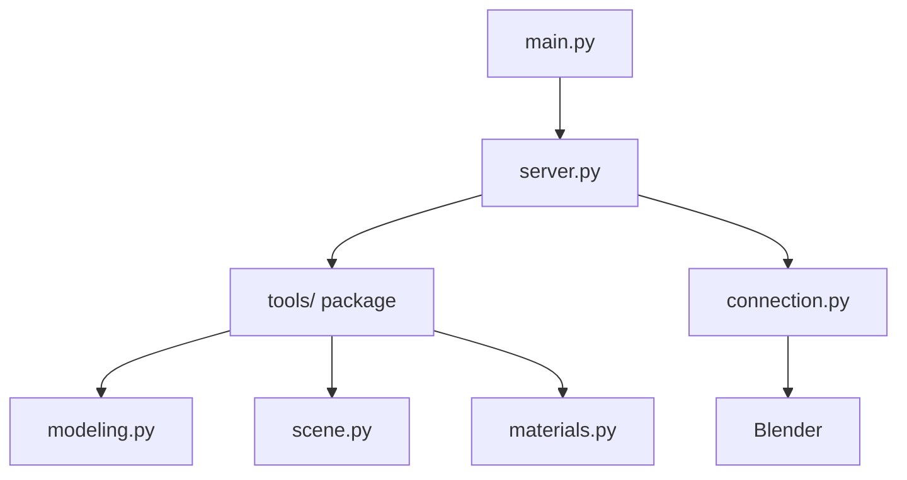

# Blender MCP Server for n8n

A Model Context Protocol (MCP) server that exposes Blender's 3D modeling capabilities to n8n workflows via HTTP SSE transport.

## Quick Start

### 1. Install Dependencies

```bash
pip install -r requirements.txt
```

## Installation

### Method 1: Zip & Install (Recommended)
1. Zip the `blender_mcp_addon` folder (into `blender_mcp_addon.zip`).
2. Open Blender.
3. Go to **Edit** > **Preferences** > **Add-ons**.
4. Click **Install...** and select the `.zip` file.
5. Search for "Blender MCP" and enable the checkbox.

### Method 2: Manual Copy (Developer)
1. Copy the `blender_mcp_addon` folder to your Blender addons directory:
   - **Windows**: `%USERPROFILE%\AppData\Roaming\Blender Foundation\Blender\4.x\scripts\addons`
   - **macOS**: `~/Library/Application Support/Blender/4.x/scripts/addons`
2. Restart Blender.
3. Enable "Blender MCP" in Preferences.

## Why a folder instead of a single file?
As the addon grows, a single 1800+ line file becomes unmaintainable. We've split the logic into functional modules (`modeling`, `materials`, `anim`, etc.) to make it professional, readable, and easier to extend.

## Usage

### 1. Configure n8n Workflow


1. Open the **N Panel** (press `N` in the 3D Viewport).
2. Look for the **Blender MCP** tab.
3. Click **Start MCP Server**.

### 2. Updating & Applying Changes
If you modify the addon code or the MCP server logic, follow these steps to ensure changes are applied:
1. **Reload Scripts**: In Blender, press `F3` and type **"Reload Scripts"** (or use the shortcut `Alt + R` if configured).
2. **Restart Blender Server**: In the N-Panel, click **Stop MCP Server** and then **Start MCP Server** again.
3. **Restart Python Server**: Stop and restart the server with `python -m src.main`.

> [!IMPORTANT]
> All Blender operations now run on the main thread via a command queue, ensuring stability and preventing dependency graph errors.

### 3. Start the MCP Server

```bash
python -m src.main
```

The server will start on `http://localhost:8000` with SSE endpoint at `/sse`. It uses detailed logging to show exactly which tools are being called and their results.

### 4. Configure n8n

In your n8n workflow:

1. Add **MCP Client Tool** node
2. Configure:
   - **SSE Endpoint**: `http://localhost:8000/sse`
   - **Authentication**: None
   - **Tools to Include**: All

3. Connect to an **AI Agent** node

## Available Tools

The server exposes **45+ Blender tools** across several categories:

### Scene & Inspection
| Tool | Explanation |
|---|---|
| `get_scene_info` | Get information about the current Blender scene (objects, collections, etc.). |
| `get_object_info` | Get detailed information about a specific object. |
| `get_viewport_screenshot` | Capture a screenshot of the 3D viewport. |
| `get_distance` | Measure the distance between two objects. |
| `get_debug_info` | Get diagnostic information about the MCP server. |

### Collections
| Tool | Explanation |
|---|---|
| `create_collection` | Create a new collection in the scene. |
| `set_active_collection` | Set the active collection for new objects. |
| `move_to_collection` | Move objects to a specific collection. |
| `get_collections` | Get the hierarchy of all collections in the scene. |

### Modeling
| Tool | Explanation |
|---|---|
| `create_cube` | Create/update a cube mesh. |
| `create_cylinder` | Create/update a cylinder mesh. |
| `create_sphere` | Create/update a UV sphere mesh. |
| `create_icosphere` | Create/update an Ico sphere mesh. |
| `create_torus` | Create/update a torus mesh. |
| `create_plane` | Create/update a plane mesh. |
| `duplicate_object` | Duplicate an object with optional transformations. |
| `create_and_array` | Create a primitive and apply a linear array modifier in one step. |
| `batch_transform` | Transform multiple existing objects at once. |
| `apply_modifier` | Add and configure a modifier (ARRAY, SOLIDIFY, BEVEL, etc.). |
| `copy_modifier` | Copy a modifier from a source object to targets. |
| `remove_modifier` | Remove a modifier from an object. |
| `boolean_operation` | Perform INTERSECT, UNION, or DIFFERENCE between objects. |
| `transform_object` | Transform an existing object (location, rotation, scale). |
| `circular_array` | Create objects arranged in a circular/radial pattern. |
| `select_objects` | Select multiple objects by name. |
| `select_by_pattern` | Select objects matching a glob pattern (e.g., 'Facade_Fin*'). |
| `set_object_dimensions` | Set exact dimensions for an object in meters. |
| `join_objects` | Join multiple objects into a single mesh. |
| `random_distribute` | Randomly distribute copies of an object with constraints. |

### Materials
| Tool | Explanation |
|---|---|
| `create_material` | Create a material with PBR presets and assign it to objects. |
| `assign_material` | Assign an existing material to objects or patterns. |
| `set_material_properties` | Modify properties of an existing material. |
| `add_shader_node` | Add a shader node to a material's node tree. |
| `connect_shader_nodes` | Connect two shader nodes in a material. |
| `assign_builtin_texture` | Apply a procedural texture to a material. |

### Animation
| Tool | Explanation |
|---|---|
| `set_keyframe` | Set a keyframe for an object property at a specific frame. |
| `get_keyframes` | Get all keyframes for an object. |
| `set_timeline_range` | Set the start, end, and current playback frames. |
| `play_animation` | Start or stop animation playback. |

### Rendering
| Tool | Explanation |
|---|---|
| `configure_render_settings` | Set render engine, samples, and resolution. |
| `render_frame` | Render the current frame to a file. |
| `render_animation` | Render an animation sequence to a directory. |

### Camera
| Tool | Explanation |
|---|---|
| `create_camera` | Create a new camera in the scene. |
| `set_active_camera` | Set the active camera for the viewport and rendering. |
| `camera_look_at` | Point a camera at a target location. |

### Lighting
| Tool | Explanation |
|---|---|
| `create_light` | Create POINT, SUN, SPOT, or AREA lights. |
| `configure_light` | Update light properties like energy, color, and size. |

## Example Usage in n8n

Use natural language with the AI Agent:

- "Create a red metallic sphere at position [0, 0, 2]"
- "Duplicate 'Base_Slab', move it to Z=80, and remove its Array modifier"
- "Select both the glass and railing, then copy the Array modifier from the glass to the railing"
- "Add a torus with minor_radius 0.1 and major_radius 25"

## Examples

Check out our step-by-step examples to see the server in action:

*   [**Condominium Tower**](docs/examples/condominium_tower.md): A complete guide to creating a procedural 20-story building with glass facade and balconies.

## Configuration

Set environment variables in `.env`:

```
BLENDER_MCP_HOST=127.0.0.1
BLENDER_MCP_PORT=9877
```

## Architecture & Technical Design

This project uses a modular `src/` structure to ensure maintainability:



### Transport Model

Although the MCP specification supports persistent SSE sessions, many clients (including n8n) currently operate in a stateless execution model, performing:

`Initialize` → `Discover Tools` → `Call Tool` → `Close`

for each interaction.

The server therefore supports:
- **SSE session mode**: For fully stateful MCP clients.
- **Stateless JSON-RPC fallback**: For per-call execution clients like n8n.

### The Stateless Fallback Mechanism

To ensure reliability across clients, the server implements a robust fallback strategy:

1. **Protocol Resilience**: If no active SSE session exists, the server transparently handles standard JSON-RPC requests over HTTP.
2. **Execution Isolation**: Each tool call is processed independently, preventing session corruption or deadlocks.
3. **Visual Success Indicators**: Tool responses are prefixed with `✓` when successful. This helps the AI Agent’s conversational memory confirm task completion and avoid unintended re-execution loops.
4. **Clear State Boundaries**: Persistent state is intentionally separated:
   - 🧠 **Conversation memory** → AI Agent (n8n Simple Memory)
   - 🧩 **Scene state** → Blender runtime
   - 🚀 **MCP server** → Stateless execution bridge

### Architecture Diagram

```
n8n AI Agent 
      ↓
MCP Client (Stateless JSON-RPC)
      ↓
MCP Server (ASGI)
      ↓
TCP Socket Bridge
      ↓
Blender Addon (Main Thread Queue)
      ↓
Blender Scene (Persistent State)
```

## Troubleshooting

**Server won't start**: Install dependencies with `pip install -r requirements.txt`

**Connection failed**: Ensure Blender MCP addon is running on port 9877.

**Dependency Graph Error**: If you see this, ensure you have the latest `blender_mcp_addon` package which implements the main-thread command queue.

**Tools not appearing in n8n**: Check the SSE endpoint URL is correct (`http://localhost:8000/sse`)

## Acknowledgments

This project was inspired by [blender-mcp](https://github.com/ahujasid/blender-mcp) by [ahujasid], which demonstrated the potential of MCP servers for Blender automation.

## License

MIT License - See LICENSE file for details


