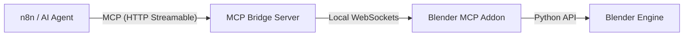
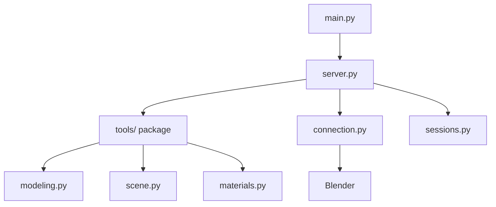

# Blender MCP Server for n8n

A Model Context Protocol (MCP) server that exposes Blender's 3D modeling capabilities to n8n workflows.

## System Architecture

To avoid confusion, this project consists of two core components:

1.  **Blender MCP Addon**: A plugin installed *inside* Blender. It acts as the local execution engine, receiving commands and manipulating the 3D scene.
2.  **MCP Bridge Server**: A standalone Python server (`src/`) that acts as the gateway. Clients like **n8n** connect to this Bridge, which then forwards commands to the active Blender Addon.



## Quick Start

### 1. Install Dependencies

```bash
pip install -r requirements.txt
```

## Installation

### Method 1: Zip & Install (Recommended)
1. Zip the `blender_mcp_addon` folder (into `blender_mcp_addon.zip`).
2. Open Blender.
3. Go to **Edit** > **Preferences** > **Add-ons**.
4. Click **Install...** and select the `.zip` file.
5. Search for "Blender MCP" and enable the checkbox.

### Method 2: Manual Copy (Developer)
1. Copy the `blender_mcp_addon` folder to your Blender addons directory:
   - **Windows**: `%USERPROFILE%\AppData\Roaming\Blender Foundation\Blender\4.x\scripts\addons`
   - **macOS**: `~/Library/Application Support/Blender/4.x/scripts/addons`
2. Restart Blender.
3. Enable "Blender MCP" in Preferences.

## Why a folder instead of a single file?
As the addon grows, a single 1800+ line file becomes unmaintainable. We've split the logic into functional modules (`modeling`, `materials`, `anim`, etc.) to make it professional, readable, and easier to extend.

## Usage

### 1. Start Blender MCP Addon

1. Open the **N Panel** (press `N` in the 3D Viewport).
2. Look for the **Blender MCP** tab.
3. Click **Start MCP Server**.

### 2. Start the MCP Bridge Server

```bash
# Standard mode
python -m src.main serve

# Recording mode (Save all commands to a file)
python -m src.main serve --record my_session.json --name "Building My House"
```

The server will start on `http://localhost:8000` with HTTP Streamable endpoint at `/mcp`. It uses detailed logging to show exactly which tools are being called and their results.

## Bridge Sessions (Record & Playback)

The **Bridge Sessions** feature allows you to record yours or an AI's tool calls and replay them later. This is useful for macros, versioning your creations, or setting up complex scenes consistently.

### Recording a Session
To record all tool calls made to the bridge while the server is running:
```bash
python -m src.main serve --record path/to/session.json --name "My Project" --description "Optional description"
```
Any tool calls made by n8n or other clients will be automatically saved to the JSON file.

### Replaying a Session

To playback a previously recorded session:
```bash
# Default (Stateful - HTTP Streamable) - Recommended for speed
python -m src.main play path/to/session.json

# Stateless mode (Standard HTTP) - Slower due to handshake overhead
python -m src.main play path/to/session.json --transport stateless
```

> [!TIP]
> **Performance Note**: Stateful mode is significantly faster for playback because it maintains a persistent connection. Stateless mode requires a full MCP handshake (Initialize/Discover) for *every* individual tool call in the recording, leading to noticeable overhead.

### Session Format
Sessions are stored as JSON files containing metadata (name, description, timestamp) and a list of command objects (tool name, arguments, timestamp).

### Session Editor (Visual Inspector)
We provide a built-in static web editor to inspect and edit your recordings:
1. Open `session_editor/index.html` in your web browser.
2. Click **Load Session** and select your `session.json`.
3. You can:
   - Edit metadata (Session Name, Description).
   - Filter commands by tool name.
   - Edit tool arguments directly in the JSON editor cards.
   - Delete unnecessary commands.
   - **Export JSON** to save your changes to a new file.

### 3. Configure n8n Workflow


1. Add **MCP Client Tool** node
2. Configure:
   - **HTTP Streamable Endpoint**: `http://localhost:8000/mcp`
   - **Authentication**: None
   - **Tools to Include**: All
3. Connect to an **AI Agent** node

### 4. Development: Updating & Applying Changes

If you modify the addon code or the MCP server logic, follow these steps to ensure changes are applied:

1. **Reload Scripts**: In Blender, press `F3` and type **"Reload Scripts"** (or use the shortcut `Alt + R` if configured).
2. **Restart Blender Server**: In the N-Panel, click **Stop MCP Server** and then **Start MCP Server** again.
3. **Restart Python Server**: Stop and restart the server with `python -m src.main serve`.

> [!IMPORTANT]
> All Blender operations now run on the main thread via a command queue, ensuring stability and preventing dependency graph errors.

## Available Tools

The server exposes **45+ Blender tools** across several categories:

### Scene & Inspection
| Tool | Explanation |
|---|---|
| `get_scene_info` | Get information about the current Blender scene (objects, collections, etc.). |
| `get_object_info` | Get detailed information about a specific object. |
| `get_viewport_screenshot` | Capture a screenshot of the 3D viewport. |
| `get_distance` | Measure the distance between two objects. |
| `get_debug_info` | Get diagnostic information about the MCP server. |

### Collections
| Tool | Explanation |
|---|---|
| `create_collection` | Create a new collection in the scene. |
| `set_active_collection` | Set the active collection for new objects. |
| `move_to_collection` | Move objects to a specific collection. |
| `get_collections` | Get the hierarchy of all collections in the scene. |

### Modeling
| Tool | Explanation |
|---|---|
| `create_cube` | Create/update a cube mesh. |
| `create_cylinder` | Create/update a cylinder mesh. |
| `create_sphere` | Create/update a UV sphere mesh. |
| `create_icosphere` | Create/update an Ico sphere mesh. |
| `create_torus` | Create/update a torus mesh. |
| `create_plane` | Create/update a plane mesh. |
| `create_text` | Create/update a 3D text object. |
| `duplicate_object` | Duplicate an object with optional transformations. |
| `create_and_array` | Create a primitive and apply a linear array modifier in one step. |
| `batch_transform` | Transform multiple existing objects at once. |
| `apply_modifier` | Add and configure a modifier (ARRAY, SOLIDIFY, BEVEL, etc.). |
| `copy_modifier` | Copy a modifier from a source object to targets. |
| `remove_modifier` | Remove a modifier from an object. |
| `boolean_operation` | Perform INTERSECT, UNION, or DIFFERENCE between objects. |
| `transform_object` | Transform an existing object (location, rotation, scale). |
| `circular_array` | Create objects arranged in a circular/radial pattern. |
| `select_objects` | Select multiple objects by name. |
| `select_by_pattern` | Select objects matching a glob pattern (e.g., 'Facade_Fin*'). |
| `set_object_dimensions` | Set exact dimensions for an object in meters. |
| `join_objects` | Join multiple objects into a single mesh. |
| `random_distribute` | Randomly distribute copies of an object with constraints. |

### Materials
| Tool | Explanation |
|---|---|
| `create_material` | Create a material with PBR presets and assign it to objects. |
| `assign_material` | Assign an existing material to objects or patterns. |
| `set_material_properties` | Modify properties of an existing material. |
| `add_shader_node` | Add a shader node to a material's node tree. |
| `connect_shader_nodes` | Connect two shader nodes in a material. |
| `assign_builtin_texture` | Apply a procedural texture to a material. |

### Animation
| Tool | Explanation |
|---|---|
| `set_keyframe` | Set a keyframe for an object property at a specific frame. |
| `get_keyframes` | Get all keyframes for an object. |
| `set_timeline_range` | Set the start, end, and current playback frames. |
| `play_animation` | Start or stop animation playback. |

### Rendering
| Tool | Explanation |
|---|---|
| `configure_render_settings` | Set render engine, samples, and resolution. |
| `render_frame` | Render the current frame to a file. |
| `render_animation` | Render an animation sequence to a directory. |

### Camera
| Tool | Explanation |
|---|---|
| `create_camera` | Create a new camera in the scene. |
| `set_active_camera` | Set the active camera for the viewport and rendering. |
| `camera_look_at` | Point a camera at a target location. |

### Lighting
| Tool | Explanation |
|---|---|
| `create_light` | Create POINT, SUN, SPOT, or AREA lights. |
| `configure_light` | Update light properties like energy, color, and size. |

## Example Usage in n8n

### Example Interaction

**User:** "Create a red metallic sphere at position [0, 0, 2]"
> **Assistant:** Perfect! I've successfully created a red metallic sphere at position [0, 0, 2]. Here's what was done:
> - Created a sphere named "RedMetallicSphere" with a radius of 1 unit at coordinates [0, 0, 2]
> - Applied a red metallic material using a polished metal preset with a red base color (#FF0000)
> 
> The sphere is now ready in your Blender scene with a shiny red metallic appearance.

**User:** "Duplicate the red sphere, move it to [5, 0, 2], and change its color to blue"
> **Assistant:** Perfect! I've successfully completed all the tasks:
> - Duplicated the red sphere and created a new object named "BlueMetallicSphere"
> - Moved it to position [5, 0, 2]
> - Changed the material to blue metallic with a polished metal finish
> 
> You now have two metallic spheres in your scene: RedMetallicSphere at [0, 0, 2] (red) and BlueMetallicSphere at [5, 0, 2] (blue).

**User:** "Select both the original red sphere and the duplicate, then add a Subdivision modifier to both"
> **Assistant:** Excellent! I've successfully:
> - Selected both spheres (RedMetallicSphere and BlueMetallicSphere)
> - Added a Subdivision Surface modifier (SUBSURF) to both objects with 2 levels of subdivision
> 
> This modifier will smooth and refine the geometry of both spheres, giving them a more polished and rounded appearance.

**User:** "Add a torus with minor_radius 0.1 and major_radius 25 at [2, 0, 0]"
> **Assistant:** Perfect! I've successfully created a torus with the specifications you requested:
> - **Name:** Torus
> - **Position:** [2, 0, 0]
> - **Major radius:** 25 (distance from center to center of the tube)
> - **Minor radius:** 0.1 (thickness of the tube)
> 
> This creates a very thin, large torus - essentially a large ring with a thin profile. It's now in your Blender scene alongside the two metallic spheres!

## Community Showcase

This project is powered by its community! Explore recorded sessions and documentation created by users to see what's possible with the Blender MCP:

*   [**Community Gallery**](community/README.md): Browse all user-submitted projects and learn how to contribute your own recordings.
*   [**Condominium Tower**](community/condominium_tower/README.md): A complete guide to creating a procedural 20-story building with glass facade and balconies.
*   [**Boolean Pavilion**](community/boolean_pavilion/README.md): Demonstrates boolean operations, unified structures, and advanced lighting/camera setup.

> [!TIP]
> **Share Your Work**: Have you built something cool? Check out our [**Contribution Guide**](community/README.md) to learn how to record, clean, and share your session with the community!

## ⚡ POWER TIPS: Avoiding Rate Limits

To prevent n8n or LLM "Too many requests" errors, follow these **Stateless Power Working** rules:

### 1. Avoid Selection-Based Workflows
❌ **Slow (4+ turns):** `select_by_pattern('Wall_*')` → `create_material('M_Gray')` → `assign_material()`
✅ **Fast (1 turn):** `create_material(name='M_Gray', pattern='Wall_*')`

### 2. Group by Collections
❌ **Unreliable:** Selecting individual objects.
✅ **Reliable:** `create_material(name='M_Glass', collection='Cutters')`

### 3. Bulk creation
If you need 10 objects, don't create them one-by-one. Use `create_and_array` or `duplicate_object` with `count`.

## Configuration

Set environment variables in `.env`:

```
BLENDER_MCP_HOST=127.0.0.1
BLENDER_MCP_PORT=8888
BLENDER_ASSETS_DIR=C:/path/to/your/assets

```

## Architecture & Technical Design

This project uses a modular `src/` structure to ensure maintainability:



### Transport Model

Although the MCP specification supports persistent HTTP Streamable sessions, many clients (including n8n) currently operate in a stateless execution model, performing:

`Initialize` → `Discover Tools` → `Call Tool` → `Close`

for each interaction.

The server uses the official **HTTP Streamable** transport introduced in MCP SDK 1.8.0+, which supports both stateful sessions and stateless requests.

### The Stateless Fallback Mechanism

To ensure reliability across clients, the server implements a robust fallback strategy:

1. **Protocol Resilience**: If no active HTTP Streamable session exists, the server transparently handles standard JSON-RPC requests over HTTP.
2. **Execution Isolation**: Each tool call is processed independently, preventing session corruption or deadlocks.
3. **Visual Success Indicators**: Tool responses are prefixed with `✓` when successful. This helps the AI Agent’s conversational memory confirm task completion and avoid unintended re-execution loops.
4. **Clear State Boundaries**: Persistent state is intentionally separated:
   - 🧠 **Conversation memory** → AI Agent (n8n Simple Memory)
   - 🧩 **Scene state** → Blender runtime
   - 🚀 **MCP server** → Stateless execution bridge

### Architecture Diagram

```
n8n AI Agent 
      ↓
MCP Client (HTTP Streamable / JSON-RPC)
      ↓
MCP Server (ASGI)
      ↓
TCP Socket Bridge
      ↓
Blender Addon (Main Thread Queue)
      ↓
Blender Scene (Persistent State)
```

## Troubleshooting

**Server won't start**: Install dependencies with `pip install -r requirements.txt`

**Connection failed**: Ensure Blender MCP addon is running on port 8888.

**Dependency Graph Error**: If you see this, ensure you have the latest `blender_mcp_addon` package which implements the main-thread command queue.

**Tools not appearing in n8n**: Check the HTTP Streamable endpoint URL is correct (`http://localhost:8000/mcp`)

## Acknowledgments

This project was inspired by [blender-mcp](https://github.com/ahujasid/blender-mcp) by [ahujasid], which demonstrated the potential of MCP servers for Blender automation.

## License

MIT License - See LICENSE file for details


