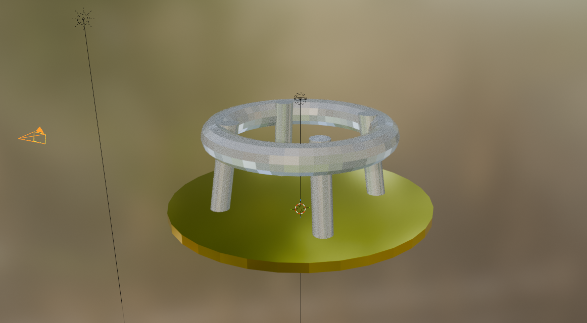

# Creating a Boolean Pavilion

This demonstrates how I used the Blender MCP server to create a modern architectural pavilion using boolean logic and unified structures. The conversation below shows a step-by-step interaction to build the pavilion from scratch.

**Model Used:** gpt-5-nano


## How to Replay

To recreate this pavilion in your own Blender instance, ensure the MCP server is running and execute:

```bash
python -m src.main play community/boolean_pavilion/session.json
```

## Conversation Log

**User:**
> 1. Create a new top-level collection named 'Boolean_Pavilion' and make it active

**Assistant:**
> Done. The top-level collection 'Boolean_Pavilion' has been created and is now the active collection for new objects.
> 
> Would you like me to add a starter object (e.g., a floor plane) in this collection or move existing objects into it?

---

**User:**
> 2. Create a torus named 'Dome' with major radius 8.6, minor radius 1.5 at location (0, 0, 8.5)

**Assistant:**
> Done. The torus named "Dome" has been created in the Boolean_Pavilion collection at location (0, 0, 8.5) with:
> *   Major radius: 8.6
> *   Minor radius: 1.5
> 
> Geometry verified. Would you like me to assign a material, adjust its orientation, or add more elements to the pavilion?

---

**User:**
> 3. Create a cylinder named 'Base_Slab' with radius 14 and height 1 at location (0, 0, 0.5)

**Assistant:**
> Base_Slab cylinder created successfully in the Boolean_Pavilion collection.
>
> Details:
> *   Type: cylinder
> *   Name: Base_Slab
> *   Location: (0, 0, 0.5)
> *   Radius: 14
> *   Height (depth): 1
> *   Status: created, geometry verified
> 
> Would you like me to:
> *   Assign a material (e.g., concrete) or adjust its material properties?
> *   Set its orientation or rotation?
> *   Add more pavilion elements (e.g., walls, floor, or a roof) or align with the Dome?

---

**User:**
> 4. Create 4 cylindrical support pillars with radius 1 and height 10: - 'Pillar_North' at location (0, 8, 5) - 'Pillar_South' at location (0, -8, 5) - 'Pillar_East' at location (8, 0, 5) - 'Pillar_West' at location (-8, 0, 5)

**Assistant:**
> All four cylindrical pillars have been created in the Boolean_Pavilion collection:
> *   Pillar_North: location (0, 8, 5), radius 1, height 10
> *   Pillar_South: location (0, -8, 5), radius 1, height 10
> *   Pillar_East: location (8, 0, 5), radius 1, height 10
> *   Pillar_West: location (-8, 0, 5), radius 1, height 10
> 
> Notes:
> *   Each pillar is oriented along the Z axis, spanning from z = 0 to z = 10.
> *   The Dome at (0, 0, 8.5) may intersect with the pillar tops depending on the exact geometry. If you want, I can adjust pillar heights or Dome placement to ensure clean clearance.
> 
> Would you like me to:
> *   assign materials (e.g., concrete or metal),
> *   add base plates or caps,
> *   or modify positions/heights to better align with the Dome?

---

**User:**
> 5. The pillars look a bit static. Use `shear_mesh` to lean each pillar slightly towards the center of the pavilion to create a tapered, modern silhouette.

**Assistant:**
> All four pillars have been leaned toward the pavilion center as requested:
> *   Pillar_North: lean on Y by -0.15 (toward -Y)
> *   Pillar_South: lean on Y by +0.15 (toward +Y)
> *   Pillar_East: lean on X by -0.15 (toward -X)
> *   Pillar_West: lean on X by +0.15 (toward +X)
> 
> Notes:
> *   Each pillar remains in the Boolean_Pavilion collection.
> *   The Dome at (0, 0, 8.5) may intersect the pillar tops depending on exact geometry. If you want, I can:
>   *   adjust pillar heights or Dome position for clean clearance
>   *   add base plates or caps to the pillars
>   *   assign materials (e.g., concrete for pillars, metal for caps)
>   *   set up a quick visual render to review the silhouette
> 
> What would you like to do next?

---

**User:**
> 6. Fuses the geometry of the torus and all 4 pillars (Pillar_*) into a single, unified object. Name it as Unified_Structure

**Assistant:**
> Done. The geometry of the torus (Dome) and all four pillars (Pillar_North, Pillar_South, Pillar_East, Pillar_West) has been fused into a single object named Unified_Structure.
> 
> Notes:
> *   Original components are merged into one mesh in the current active collection (Boolean_Pavilion).
> *   If you’d like, I can:
>   *   assign a material (e.g., concrete for the pillars, metal for the dome, or a unified material),
>   *   adjust the origin or apply transforms,
>   *   perform cleanup (normals, doubles, shading),
>   *   move Unified_Structure to a different collection,
>   *   render a quick preview to review the silhouette.
> 
> What would you like to do next?

---

**User:**
> 7. Create a material named 'Architectural_Glass' using the **glass_frosted** preset with a subtle blue tint (#E0F7FF). Assign it to Unified_Structure

**Assistant:**
> All set. The material "Architectural_Glass" (glass_frosted preset) was created with:
> *  Base color: #E0F7FF
> *  Roughness: 0.1
> *  Metallic: 0
> *  Transmission: 1
> *  Index of refraction (IOR): 1.52
>
> It has been assigned to Unified_Structure (slot 0).
> 
> Would you like me to:
> *   render a quick viewport preview to review the translucency?
> *   tweak any material parameters (color, roughness, transmission, IOR)?
> *   apply the material to any other objects or add a separate material for internal faces?

---

**User:**
> 8. Create a material named 'Premium_Base' using the **metal_gold** preset with 0.2 roughness. Assign it to Base_Slab

**Assistant:**
> All set. The material is created and assigned.
> *   Material: Premium_Base
> *   Preset: metal_gold
> *   Roughness: 0.2
> *   Assigned to: Base_Slab (in Boolean_Pavilion)
> 
> Would you like me to:
> *   assign Premium_Base to any other objects,
> *   tweak additional properties (IOR, color tint, or emissive for a glow),
> *   render a quick preview to review the look?

---

**User:**
> 9. Add a SUN light named 'Primary_Sun' with strength 3.0 and warm golden tone. Position it at location (18, -18, 22)

**Assistant:**
> Done. Created a SUN light named Primary_Sun with:
> *   Location: (18, -18, 22)
> *   Energy: 3.0
> *   Color: #FFD27A (warm golden)
> 
> Note: In Blender, a SUN's direction is determined by its rotation. I can rotate it to point toward the pavilion center or toward Unified_Structure if you’d like. 
>
> Would you like me to:
> *   Orient it to face the pavilion center (or a specific target)?
> *   Adjust its angular size or shadow softness?
> *   Render a quick preview?

---

**User:**
> 10. Add an AREA light named 'Interior_Light' with strength 2.0 and cool blue tone at location (0, 0, 12)

**Assistant:**
> Interior_Light has been created as an AREA light.
> 
> Details:
> *   Name: Interior_Light
> *   Type: AREA
> *   Location: (0, 0, 12)
> *   Energy (strength): 2.0
> *   Color: #66CCFF (cool blue)
> 
> Would you like me to:
> *   rotate/aim it toward the pavilion center or Unified_Structure,
> *   adjust its size for softer/sharper illumination,
> *   or render a quick preview to review the lighting?

---

**User:**
> 11. Create a camera named 'Main_View' at location (22, -22, 16) looking at (0, 0, 9)

**Assistant:**
> Camera 'Main_View' has been created at location (22, -22, 16) and is oriented to look at (0, 0, 9).
> 
> Would you like me to:
> *   set Main_View as the active camera for rendering,
> *   adjust its lens, clip start/end, or other camera properties,
> *   render a quick preview from this camera?


