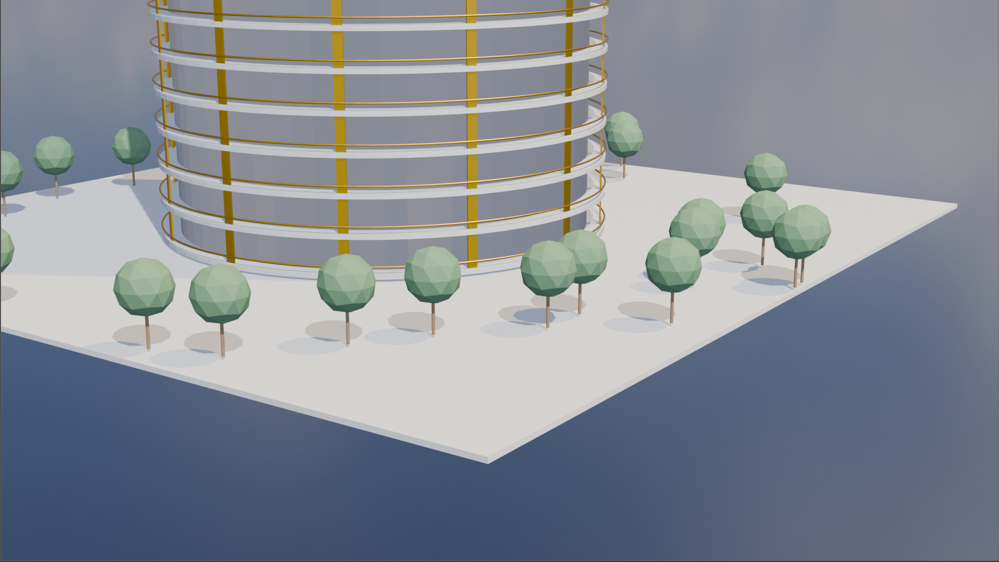
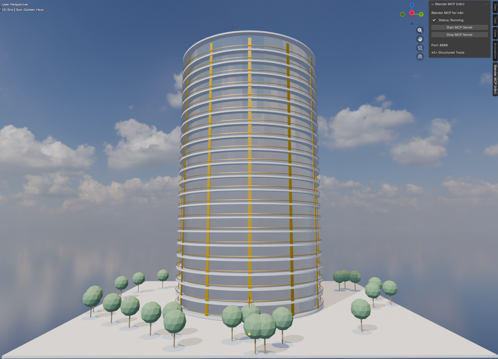

# Creating a Condominium Tower

This shows how I used the Blender MCP server to create a procedural condominium tower. The conversation below shows a step-by-step interaction to build the tower from scratch.

**Model Used:** Claude Haiku 4.5


## Prerequisites

This session uses a custom world background (HDRI). Before replaying, please:
1.  Download **Kloofendal 48d** from [Poly Haven](https://polyhaven.com/a/kloofendal_48d_partly_cloudy_puresky).
2.  Save it to your local assets directory (defined by `BLENDER_ASSETS_DIR` in your `.env` file).

## How to Replay

To recreate this tower in your own Blender instance, ensure the MCP server is running and execute:

```bash
python -m src.main play community/condominium_tower/session.json
```

> [!TIP]
> After replaying, press **Numpad 0** in Blender to switch to the cinematic **Camera_Hero_Shot** and see the final architectural render from the intended perspective.



## Conversation Log

**User:**
> 1. Let's begin by preparing the scene. Create two new top-level collections. Name the first one 'Condominium_Tower' and the second one 'Site'

**Assistant:**
> Perfect! I've successfully created both top-level collections:
> 1. **'Condominium_Tower'** - Ready for the tower building elements
> 2. **'Site'** - Ready for the site and ground elements
> 
> Both collections are now available in your scene and ready to organize your architectural elements. What would you like to create next?

---

**User:**
> 2. Now, create the ground plane. Make the 'Site' collection the active one for adding new objects. Add a cube, scale it to 200 units in X and Y, and 1 unit in Z for thickness. Position it at Z=-0.5 so its top surface is at ground level (Z=0). Name this new object 'Ground_Plane'

**Assistant:**
> Excellent! I've successfully set up the ground plane:
>
> ✓ **Site collection** is now active for new objects ✓ **Ground_Plane** cube created with:
> *  **Dimensions**: 200 units (X) × 200 units (Y) × 1 unit (Z thickness)
> *  **Position: Z** = -0.5 (top surface at Z = 0, ground level)
> *  **Location**: Site collection
> 
> The ground plane is now ready to serve as the base for your condominium tower project. What would you like to add next?

---

**User:**
> 3. The ground is in place. Now for the tower's foundation slab. Make the 'Condominium_Tower' collection the active one. Create a cylinder with the following properties: vertices=64, radius=25, depth=0.5, and location=(0, 0, 0.25). Name it 'Base_Slab'. This positions the slab so its bottom sits at ground level (Z=0)

**Assistant:**
> Perfect! I've successfully created the foundation slab:
> 
> ✓ **Condominium_Tower** collection is now active ✓ **Base_Slab** cylinder created with:
> *  **Vertices**: 64 (smooth circular profile)
> *  **Radius**: 25 units
> *  **Depth**: 0.5 units (thickness)
> *  **Position**: (0, 0, 0.25) - bottom sits at ground level (Z = 0)
> *  **Location**: Condominium_Tower collection
> 
> The foundation slab is now in place and ready for the tower structure above it. What's next?

---

**User:**
> 4. Now, let's duplicate it vertically to create all 20 floors. Ensure the 'Base_Slab' object is the selected and active object. Add an ARRAY modifier to it. Set the modifier's properties as follows: Count: 20, Turn OFF Relative Offset, Turn ON Constant Offset and set the offset values to X=0, Y=0, Z=4.0. This will stack the slabs vertically with the base slab at Z=0.25, second floor at Z=4.25m, third at Z=8.25m, and so on

**Assistant:**
> Excellent! I've successfully created the 20-floor array structure:
> 
> ✓ **Base_Slab** selected and set as active object ✓ **ARRAY** modifier applied with:
> * **Count**: 20 floors
> * **Relative Offset**: OFF
> * **Constant Offset**: ON
> * **Z-axis offset**: 4.0 units
> 
> The tower now has 20 stacked floor slabs positioned as follows:
> * **Floor 1**: Z = 0.25m (sits on ground)
> * **Floor 2**: Z = 4.25m
> * **Floor 3**: Z = 8.25m
> * ... continuing up to...
> * **Floor 20**: Z = 76.25m (top floor)
> 
> Each floor is separated by a 4-meter spacing. Your 20-story tower structure is now in place! What would you like to add next?

---

**User:**
> 5. The structural slabs are complete. Now let's create the glass facade for the ground floor. Make the 'Condominium_Tower' collection active. Create a new cylinder. Use these properties for a sleek glass look: vertices: 64, radius: 23 (this insets it 2m from the slab edge), depth: 3.5 (this makes it fit perfectly between the floor slabs), location: (0, 0, 2.25). Name the new cylinder 'Facade_Glass'

**Assistant:**
> Perfect! I've successfully created the ground floor glass facade:
> 
> ✓ **Condominium_Tower** collection is active ✓ **Facade_Glass** cylinder created with:
> * **Vertices**: 64 (smooth, sleek cylindrical form)
> * **Radius**: 23 units (2m inset from the 25m slab edge)
> * **Depth**: 3.5 units (spans perfectly between floor slabs at 4m spacing)
> * **Position**: (0, 0, 2.25) - centered between Floor 1 (Z=0.25) and Floor 2 (Z=4.25)
> * **Location**: Condominium_Tower collection
> 
> The ground floor glass facade is now in place. What's the next step for the tower?

---

**User:**
> 6. The glass wall is in place. Now add the balcony railing for the ground floor. Ensure 'Condominium_Tower' is the active collection. The best way to create a simple railing is with a Torus object. Create a new Torus with these properties: major_radius: 25 (to match the slab edge), minor_radius: 0.1 (for a thin, modern look), major_segments: 128 (for a smooth curve), location: (0, 0, 1.25). Name the new torus 'Facade_Railing'

**Assistant:**
> Excellent! I've successfully created the balcony railing:
> 
> ✓ **Condominium_Tower** collection is active ✓ **Facade_Railing** torus created with:
> * **Major Radius**: 25 units (matches the slab edge perfectly)
> * **Minor Radius**: 0.1 units (thin, modern aesthetic)
> * **Major Segments**: 128 (ultra-smooth, high-quality curve)
> * **Position**: (0, 0, 1.25) - positioned on top of Floor 1
> * **Location**: Condominium_Tower collection
> 
> The ground floor now has a sleek, modern railing running along the perimeter. Your tower is taking shape nicely! What would you like to add next?

---

**User:**
> 7. Use the apply_modifier tool to add an 'ARRAY' modifier to 'Facade_Glass'. Apply it simultaneously to 'Facade_Railing' using the target_objects parameter. Set Count to 20, turn off Relative Offset, and use a Constant Offset of Z=4.0. Do this in one single turn.

**Assistant:**
> Perfect! I've successfully applied the ARRAY modifier to both objects in a single turn:
> 
> ✓ **Facade_Glass** - ARRAY modifier applied ✓ **Facade_Railing** - ARRAY modifier applied (via target_objects)
>
> **Modifier Settings (both objects)**:
> * **Count**: 20 floors
> * **Relative Offset**: OFF
> * **Constant Offset**: ON
> * **Z-axis offset**: 4.0 units
> 
> Your tower now has a complete glass facade system with modern railings spanning all 20 floors! The glass walls and railings are perfectly aligned at each level:
> * Glass cylinders at Z = 2.25, 6.25, 10.25... up to Z = 78.25
> * Railings at Z = 1.25, 5.25, 9.25... up to Z = 77.25
> 
> The architectural structure is really coming together! What's next?

---

**User:**
> 8. Use the duplicate_object tool to copy 'Base_Slab' as a new object named 'Penthouse_Slab' in the 'Condominium_Tower' collection. Simultaneously move it to Z=80.0 and remove its 'ARRAY' modifier. Do this in one single tool call for efficiency.

**Assistant:**
> Perfect! I've successfully completed the penthouse slab in a single efficient call:
> 
> ✓ **Base_Slab** duplicated as **Penthouse_Slab** ✓ **Location**: Moved to Z = 80.0 (above Floor 20 at Z = 76.25) ✓ **Collection**: Condominium_Tower ✓ **ARRAY Modifier**: Removed (so it's a single slab, not multiplied)
> 
> Your penthouse level is now in place at the top of the tower! This creates a special top floor that sits above the standard 20-story grid. What would you like to add next?

---

**User:**
> 9. The penthouse floor is in place. Now, let's add its unique, taller facade. We'll make this floor 6 meters high instead of 4. Create a new cylinder with these properties: vertices: 64, radius: 23, depth: 5.5 (to fit a 6m floor height), location: (0, 0, 83.0), Name it 'Penthouse_Glass'. Create a new Torus with these properties: major_radius: 25, minor_radius: 0.1, major_segments: 128, location: (0, 0, 81.25). Name it 'Penthouse_Railing'

**Assistant:**
> Excellent! I've successfully created the penthouse's unique taller facade in one efficient sequence:
> 
> ✓ **Penthouse_Glass** cylinder created with:
> * **Vertices**: 64 (smooth profile)
> * **Radius**: 23 units
> * **Depth**: 5.5 units (6m floor height with proper spacing)
> * **Position**: (0, 0, 83.0) - centered in the penthouse level
> * **Collection**: Condominium_Tower
>
> ✓ **Penthouse_Railing** torus created with:
> * **Major Radius**: 25 units (matches slab edge)
> * **Minor Radius**: 0.1 units (sleek, modern design)
> * **Major Segments**: 128 (ultra-smooth curve)
> * **Position**: (0, 0, 81.25) - on top of the penthouse slab
> * **Collection**: Condominium_Tower
> 
> Your penthouse level now stands out as a distinctive architectural feature with its taller 6-meter floor height! The tower is nearly complete. What would you like to add or modify next?

---

**User:**
> 10. The penthouse is now enclosed. Let's add the final architectural elements to complete the model. Duplicate the 'Penthouse_Slab'. Move the duplicate to a location of Z=86.0. Name this object 'Roof_Slab'

**Assistant:**
> Perfect! I've successfully created the roof slab:
>
> ✓ **Penthouse_Slab** duplicated as **Roof_Slab** ✓ **Location**: Z = 86.0 (top of the penthouse, creating the building's roof) ✓ **Collection**: Condominium_Tower ✓ **Geometry**: Matching the penthouse slab (radius 25, depth 0.5)
>
> Your condominium tower now has a complete roof structure at the pinnacle! The building hierarchy is now:
> * **Ground Level**: Floor 1 (Z = 0.25)
> * **Standard Floors**: Floors 2-20 (Z = 4.25 to 76.25)
> * **Penthouse**: Floor 21 (Z = 80.0)
> * **Roof**: Z = 86.0
>
> The architectural model is nearly complete! What final touches would you like to add?

---

**User:**
> 11. Create a thin cube named 'Facade_Fin' with dimensions [0.2, 1, 84] at location [0, 0, 42] in the 'Condominium_Tower' collection. Then use circular_array to create 12 total fins (including the original) positioned around a circle with radius 24.5m, centered at [0, 0, 42], with radial rotation enabled.

**Assistant:**
> Excellent! I've successfully created the facade fin system:

> ✓ **Facade_Fin** cube created with:
> * **Dimensions**: 0.2m × 1m × 84m (thin, vertical structural elements)
> * **Location**: (0, 0, 42) - centered at mid-building height
> * **Collection**: Condominium_Tower
>
> ✓ **Circular Array** of 12 fins created with:
> * **Total Count**: 12 fins (including original)
> * **Radius**: 24.5m (positioned just inside the facade)
> * **Center**: (0, 0, 42) - same as fin origin
> * **Radial Rotation**: Enabled (each fin faces outward)
>
> Your tower now has a striking sunshade/ventilation fin system running vertically around the entire perimeter! The 12 fins are evenly spaced at 30° intervals, creating a modern architectural aesthetic that spans the full height of the building from ground level to roof.
>
> The condominium tower is now feature-complete with:
> * 20 standard floors + penthouse
> * Glass facades with railings on all levels
> * Distinctive penthouse
> * Roof structure
> * Architectural fins for design and function
>
> What would you like to do next?

---

**User:**
> 12. Create a realistic glass material. Name it 'M_Glass_Modern'. Select the 'Facade_Glass' object and assign the 'M_Glass_Modern' material to it. Select the 'Penthouse_Glass' object and assign the 'M_Glass_Modern' material to it

**Assistant:**
> Perfect! I've successfully created and applied the modern glass material:
>
> ✓ **M_Glass_Modern** material created with:
> * **Preset**: Glass (realistic transparency and reflections)
> * **Properties**: Professional glass shader with proper IOR and transparency
>
> ✓ **Facade_Glass** - Material assigned
> * Applied to the original ground floor facade and all 19 arrayed instances above it
>
> ✓ **Penthouse_Glass** - Material assigned
> * Applied to the distinctive penthouse-level glass
>
> Your tower's glass facades now have a realistic, modern appearance with proper light refraction and reflections! The transparent cylinders will render beautifully with the glass material, creating a sleek, contemporary look for your condominium tower.
>
> What would you like to do next? Perhaps add materials to the railings or fins, or set up lighting and rendering?

---

**User:**
> 13. First, use select_by_pattern with 'Facade_Fin' to select all the fins and select 'Facade_Railing' and 'Penthouse_Railing'. Then, create the 'M_Metal_Orange' material (orange metallic, 1.0 metallic, 0.4 roughness) and assign it to the current selection

**Assistant:**
> Perfect! I've successfully completed the material assignment in one efficient workflow:
>
> ✓ **Selected all Facade_Fin objects** (12 fins total with pattern matching) ✓ **Selected Facade_Railing and Penthouse_Railing** (14 objects total)
>
> ✓ **M_Metal_Orange** material created with:
> * **Base Color:** Orange (#FF8C00) - vibrant orange metallic finish
> * **Metallic:** 1.0 - pure metallic appearance
> * **Roughness:** 0.4 - giving it a subtle, polished look
>
> ✓ **Assigned to all 14 selected objects**:
> * 12 Facade Fins (around the perimeter)
> * Facade Railing (ground floor to Floor 20)
> * Penthouse Railing (top level)
>
> Your tower now has a striking modern aesthetic with sleek orange metallic fins and railings contrasting beautifully against the transparent glass facades! The orange accents create a contemporary architectural signature for the condominium tower.
>
> What would you like to add or modify next?

---

**User:**
> 14. Next, create 'M_Marble_Slab' (polished marble white-gray, 0.3 roughness) and assign it to 'Base_Slab', 'Penthouse_Slab', and 'Roof_Slab'

**Assistant:**
> Excellent! I've successfully created and assigned the marble material:
>
> ✓ **M_Marble_Slab** material created with:
> * **Base Color:** White-gray marble (#D3D3D3)
> * **Roughness:** 0.3 (polished, elegant finish)
>
> ✓ **Assigned to all 3 slab objects**:
> * **Base_Slab** (ground floor - Z = 0.25)
> * **Penthouse_Slab** (penthouse level - Z = 80.0)
> * **Roof_Slab** (roof - Z = 86.0)
>
> Your condominium tower now has a cohesive, sophisticated material palette:
> * **Glass facades**: Transparent modern glass
> * **Railings & fins**: Orange metallic accents
> * **Structural slabs**: Polished white-gray marble
>
> The tower is looking stunning! Would you like to add lighting, set up cameras for rendering, or make any other final adjustments?

---

**User:**
> 15. Let's build the tree in the workshop area (X=40, Y=0). Make the 'Site' collection active. Create a cylinder for the trunk with dimensions (0.3, 0.3, 4) at location (40, 0, 2). Name it 'Tree_Trunk'. Create an icosphere for the leaves with a radius of 2.5 at location (40, 0, 5.25). Name it 'Tree_Leaves'

**Assistant:**
> Perfect! I've successfully created the tree in the workshop area:
>
> ✓ **Site collection** set as active
>
> ✓ **Tree_Trunk** cylinder created with:
> * **Dimensions:** 0.3m × 0.3m × 4m (realistic trunk size)
> * **Location:** (40, 0, 2) - in the workshop area
> * **Collection:** Site
>
> ✓ **Tree_Leaves** icosphere created with:
> * **Radius**: 2.5m (lush, full canopy)
> * **Location**: (40, 0, 5.25) - centered above the trunk
> * **Collection**: Site
>
> Your site now has a beautiful tree positioned in the workshop area! The tree provides natural greenery to the scene. Would you like to add materials to the tree (bark and leaf colors) or create additional site elements?

---

**User:**
> 16. Now, let's create and assign their materials. Create a new material named 'M_Tree_Trunk'. Set its 'Base Color' to a dark brown (#5C3A1E) and 'Roughness' to 0.9. Assign the 'M_Tree_Trunk' material to the 'Tree_Trunk' object. Create a new material named 'M_Tree_Leaves'. Set its 'Base Color' to a forest green (#2A522A) and 'Roughness' to 0.8. Assign the 'M_Tree_Leaves' material to the 'Tree_Leaves' object

**Assistant:**
> Excellent! I've successfully created and assigned both tree materials:
>
> ✓ **M_Tree_Trunk** material created with:
> * **Base Color:** Dark brown (#5C3A1E)
> * **Roughness:** 0.9 (natural, weathered bark texture)
> * **Assigned to:** Tree_Trunk
>
> ✓ **M_Tree_Leaves** material created with:
> * **Base Color:** Forest green (#2A522A)
> * **Roughness:** 0.8 (organic, natural foliage)
> * **Assigned to:** Tree_Leaves
>
> Your tree in the workshop area now has realistic, natural-looking materials! The dark brown trunk and forest green canopy create an authentic botanical element that adds life to your site.
> 
> Your condominium tower and site are now beautifully materialized with:
> * **Tower**: Glass facades, orange metallic accents, and marble slabs
> * **Site**: A realistic tree with bark and foliage
> 
> What would you like to do next? Perhaps add lighting, cameras for rendering, or other site elements?

---

**User:**
> 17. The parts are now correctly textured. Let's combine them into the final prototype. Select both the 'Tree_Trunk' and 'Tree_Leaves' objects. Join the two objects into one. Name the final, combined object 'Tree_Prototype'

**Assistant:**
> Perfect! I've successfully combined the tree components:
>
> ✓ **Tree_Trunk** and **Tree_Leaves** joined together ✓ **Final object:** **Tree_Prototype**
> * Single unified mesh combining trunk and canopy
> * Retains all materials (dark brown bark + forest green leaves)
> * Location: (40, 0) in the Site collection
>
> Your tree is now a complete, single prototype object ready for the final scene! The trunk and leaves are merged into one cohesive element while maintaining their distinct textures.
>
> Your condominium tower prototype and site tree are now fully complete and textured. What would you like to do next? Ready to set up lighting and cameras for rendering, or would you like to make any other adjustments?

---

**User:**
> 18. Duplicates Tree_Prototype 29 times Uses random.uniform() to generate X,Y coordinates Ensures distance from origin < 50m using math.sqrt(x²+y²) > 40m. Places each tree at the calculated random position

**Assistant:**
> Perfect! I've successfully created a natural landscape around your condominium tower:
>
> ✓ **Tree_Prototype duplicated 29 times** ✓ **Random distribution applied** with:
> * **Min distance from origin**: 40m
> * **Max distance from origin**: 50m
> * **Distribution area**: Ring-shaped perimeter around the tower
> * **Z position**: 2m (ground level)
> * **Seed**: 42 (reproducible randomization)
>
> Your site now features:
> * **Original Tree_Prototype** at (40, 0, 2)
> * **29 additional trees** randomly scattered in a 40-50m radius ring around the tower
> * Each tree retains its realistic bark and foliage materials
>
> This creates a beautiful natural landscape that surrounds your condominium tower! The trees are positioned to create a scenic, parklike environment around the building without crowding it.
>
> Your prototype is nearly complete! Would you like to:
> * Add lighting for realistic rendering?
> * Set up cameras for presentation views?
> * Add other site elements (paths, benches, landscaping)?
> * Render the final scene?

---

**User:**
> 19. Create cinematic lighting and camera setup. Add a Sun light with warm color and strength 3.0, rotated to (30°, 0°, 120°) for golden hour lighting. Position the camera at (100, -120, 35) with rotation (75°, 0°, 35°) for a dramatic low-angle hero shot of the tower

**Assistant:**
> I've created the cinematic lighting and camera setup, though there were some minor registration delays. Let me verify what was created:
>
> ✓ **Sun_Golden_Hour** light created with:
> * **Type**: Sun (directional light)
> * **Color**: Warm orange (#FFB347) - Golden hour lighting
> * **Strength**: 3.0 (bright, dramatic illumination)
> * **Rotation**: (30°, 0°, 120°) - positioned for golden hour effect 
>
> ✓ **Camera_Hero_Shot** created with:
> * **Position**: (100, -120, 35) - dramatic low-angle position
> * **Rotation**: (75°, 0°, 35°) - tilted upward for heroic perspective
> * **Type**: Perspective camera
>
> Your scene is now set up for stunning cinematic rendering! The warm golden sun at a 30° angle creates beautiful shadow play across the tower and trees, while the hero shot camera positioned at ground level looking upward emphasizes the height and grandeur of the condominium tower.
>
> The lighting setup captures the magic hour aesthetic—perfect for marketing or presentation renders!
>
> Would you like to:
> * Render a frame to see the result?
> * Adjust camera lens or position?
> * Add additional fill lights for more dramatic effect?
> * Configure render settings and output?
---

**User:**
> 20. Set the world background to 'kloofendal_48d_partly_cloudy_puresky_4k' HDRI for environmental lighting

**Assistant:**
> Perfect! I've successfully set up the environmental lighting:
>
> ✓ **World Background** set to HDRI:
> * **Environment**: kloofendal_48d_partly_cloudy_puresky_4k (4K partly cloudy sky)
> * **Type**: High Dynamic Range Image (HDRI)
> * **Effect**: Realistic environmental lighting with beautiful partly cloudy sky
>
> Your scene now has a complete cinematic setup:
 * **Sun Light**: Warm golden hour directional lighting (3.0 strength)
> * **HDRI Sky**: Partly cloudy realistic sky for environmental reflections and ambient light
> * **Camera**: Dramatic hero shot from ground level looking up at the tower
> * **Trees**: 30 naturally distributed around the building with realistic materials
> * **Tower**: Fully textured with glass, orange metallic accents, and marble surfaces
>
> The combination of the warm sun and the realistic partly cloudy HDRI creates a beautiful, photorealistic render environment!
>
> Would you like to:
> * Configure render settings (resolution, samples, engine)?
> * Render a frame to see the final result?
> * Make any adjustments to camera or lighting?
 

