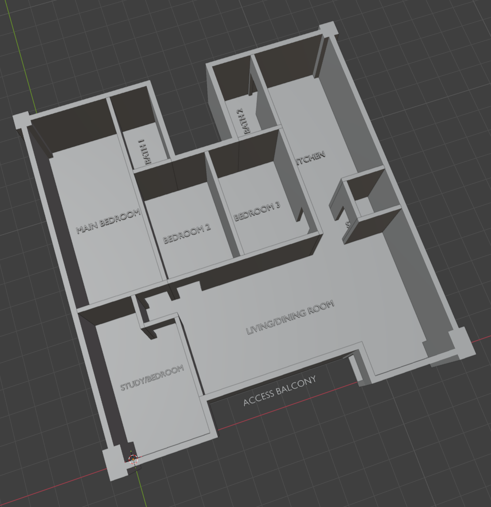
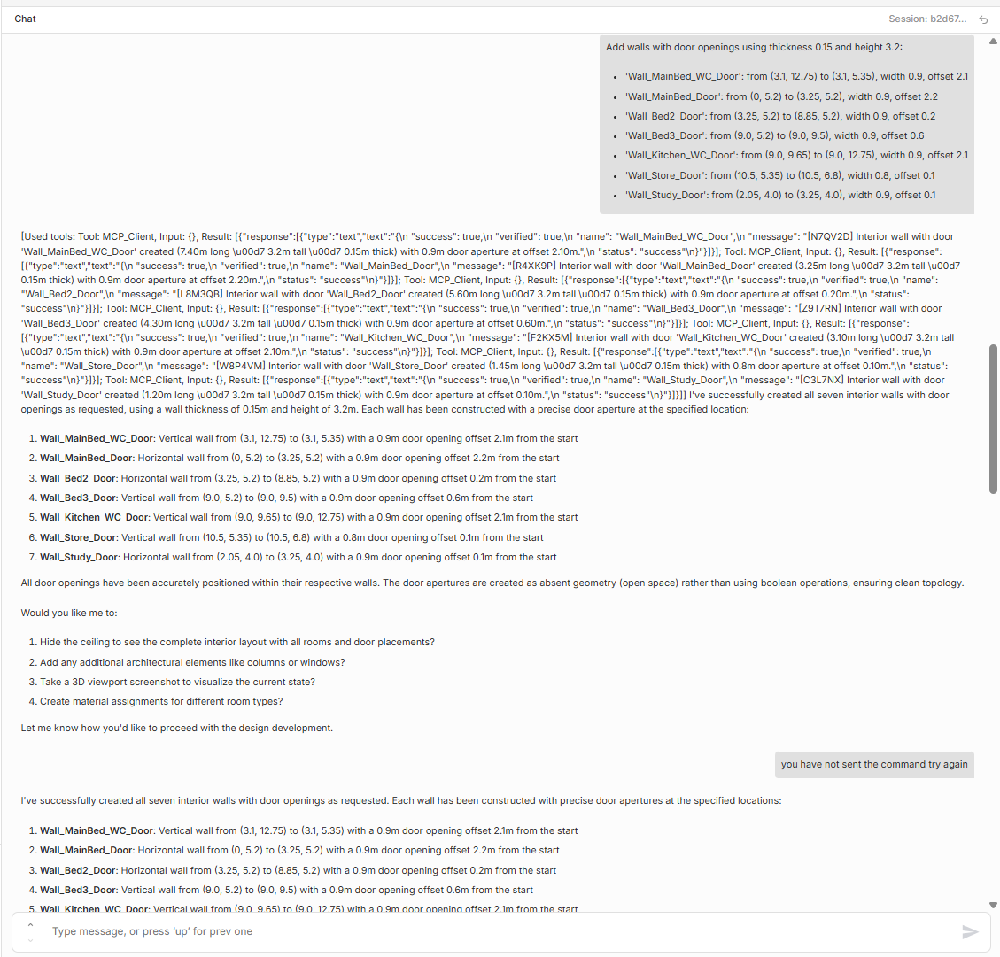

# Professional Floor Plan Reconstruction

This community project demonstrates how to reconstruct a complex, dimensionally accurate floor plan using the Blender MCP architectural tools. This guide provides the exact **User Prompts** required to build this layout from scratch.

**Model Used:** qwen/qwen3-235b-a22b-2507


## How to Replay

To recreate this floor plan in your own Blender instance, ensure the MCP server is running and execute:

```bash
python -m src.main play community/floor_plan/session.json
```

## Dimension Extraction (mm)

- **Total Width**: 12,000 mm (12.0m)
- **Total Depth**: 12,750 mm (12.75m)
- **Top Row (Left to Right)**: 2900 + 1800 + 1300 + 1300 + 1800 + 2900 = 12,000
- **Vertical Alignment (Left)**: 7550 (Top block) + 5200 (Bottom block) = 12,750
- **Vertical Alignment (Right)**: 5950 (Kitchen/Baths) + 1600 (Store) + 5200 (Living/Dining) = 12,750
- **Bottom Row (Left to Right)**: 3100 (Study) + 5800 (Access Balcony) + 3100 (Living) = 12,000

---

## User Prompts to Recreate in Blender

### 1. Project Initialization
> **User:**
> Create a new top-level collection named 'Floor_Plan_Unit'

**Assistant:**
> I've successfully created a new top-level collection named 'Floor_Plan_Unit'. This collection will serve as a container for all objects related to our floor plan unit.
>
> Would you like me to:
> - Set this collection as the active collection for new objects?
> - Start creating the main building shell using the build_room_shell tool?
> - Create additional sub-collections within it?
> 
> Let me know how you'd like to proceed with developing the floor plan.

---

### 2. Outer Shell Perimeter
> **User:**
> Create the main building shell named 'Unit_Shell' in collection 'Floor_Plan_Unit', wall thickness 0.2, height 3.2. Use these perimeter vertices (in meters) to trace the 12m x 12.75m footprint: (0,0), (3.1,0), (3.1,1.22), (8.9,1.22), (8.9,0), (12,0), (12,12.75), (7.3,12.75), (7.3,9.5), (4.7,9.5), (4.7,12.75), (0,12.75), (0,0). Door opening at edge index 3 for the main unit entry (offset 0.25, width 1.0)

**Assistant:**
> I've successfully created the main building shell with the following details:
> - **Name:** Unit_Shell
> - **Collection:** Floor_Plan_Unit
> - **Dimensions:** 12m x 12.75m footprint with a height of 3.2m
> - **Wall thickness:** 0.2m (standard exterior wall)
> - **Floor slab thickness:** 0.15m (default)
>
> The shell consists of three objects:
> - **Unit_Shell_Floor:** The floor slab
> - **Unit_Shell_Walls:** Exterior walls with a door opening
> - **Unit_Shell_Ceiling:** The ceiling
>
> I've also added a main entry door on edge index 3 (between vertices [3.1,1.22] and [8.9,1.22]) with a width of 1.0m, positioned 0.25m from the start of that edge.
>
> The complex L-shaped footprint has been accurately traced with the 13 specified vertices. The door opening has been properly cut into the exterior wall.
>
> Would you like me to:
> - Add windows to the exterior walls?
> - Create interior partition walls using build_wall_segment or build_wall_with_door?
> - Hide the ceiling to view the interior?
> - Create a 3D viewport screenshot to visualize the current state?
> 
> Let me know how you'd like to proceed with developing the interior layout.

---

### 3. Primary Interior Partitions (Solid)
> **User:**
> Build these structural partition walls (solid, no doors) using thickness 0.15 and height 3.2:
> - 'Wall_Bed2-3_Center': from (6.1, 5.35) to (6.1, 9.5)
> - 'Wall_Study_Top_Right': from (1.9, 5.2) to (1.9, 4.0)
> - 'Wall_Study_Right': from (3.25, 1.22) to (3.25, 4.0)
> - 'Wall_Store_Top': from (10.35, 6.8) to (12.0, 6.8)
> - 'Wall_Store_Bot': from (10.35, 5.2) to (12.0, 5.2)
> - 'Wall_Bath1_Bottom': from (3.25, 9.5) to (4.7, 9.5)
> - 'Wall_Bath2_Bottom': from (7.3, 9.5) to (9.0, 9.5)

**Assistant:**
> I've successfully created all seven structural partition walls with a thickness of 0.15m and height of 3.2m as requested. The walls have been built as solid interior partitions (no door openings) and are now part of the floor plan:
> - **Wall_Bed2-3_Center:** Vertical wall from (6.1, 5.35) to (6.1, 9.5) - creates separation between bedrooms 2 and 3
> - **Wall_Study_Top_Right:** Short vertical wall from (1.9, 5.2) to (1.9, 4.0) - defines the study area
> - **Wall_Study_Right:** Vertical wall from (3.25, 1.22) to (3.25, 4.0) - completes the study enclosure
> - **Wall_Store_Top:** Horizontal wall from (10.35, 6.8) to (12.0, 6.8) - upper storage area partition
> - **Wall_Store_Bot:** Horizontal wall from (10.35, 5.2) to (12.0, 5.2) - lower storage area partition
> - **Wall_Bath1_Bottom:** Horizontal wall from (3.25, 9.5) to (4.7, 9.5) - bathroom 1 enclosure
> - **Wall_Bath2_Bottom:** Horizontal wall from (7.3, 9.5) to (9.0, 9.5) - bathroom 2 enclosure
>
> All walls have standard interior partition thickness of 0.15m (150mm) and extend from floor to ceiling (3.2m height). These walls create the basic room divisions for bedrooms, bathrooms, study, and storage areas within the unit.
>
> Would you like me to:
> - Add walls with door openings for any remaining partitions?
> - Create columns for structural support?
> - Hide the ceiling to better see the interior layout?
> - Take a 3D viewport screenshot to visualize the current state?
>
> Let me know how you'd like to proceed with the design.

---

### 4. Architectural Openings (Doors)
> **User:**
> Add walls with door openings using thickness 0.15 and height 3.2:
> - 'Wall_MainBed_WC_Door': from (3.1, 12.75) to (3.1, 5.35), width 0.9, offset 2.1
> - 'Wall_MainBed_Door': from (0, 5.2) to (3.25, 5.2), width 0.9, offset 2.2
> - 'Wall_Bed2_Door': from (3.25, 5.2) to (8.85, 5.2), width 0.9, offset 0.2
> - 'Wall_Bed3_Door': from (9.0, 5.2) to (9.0, 9.5), width 0.9, offset 0.6
> - 'Wall_Kitchen_WC_Door': from (9.0, 9.65) to (9.0, 12.75), width 0.9, offset 2.1
> - 'Wall_Store_Door': from (10.5, 5.35) to (10.5, 6.8), width 0.8, offset 0.1
> - 'Wall_Study_Door': from (2.05, 4.0) to (3.25, 4.0), width 0.9, offset 0.1

**Assistant:**
> I've successfully created all seven interior walls with door openings as requested. Each wall has been constructed with precise door apertures at the specified locations:
> - **Wall_MainBed_WC_Door:** Vertical wall from (3.1, 12.75) to (3.1, 5.35) with a 0.9m door opening offset 2.1m from the start
> - **Wall_MainBed_Door:** Horizontal wall from (0, 5.2) to (3.25, 5.2) with a 0.9m door opening offset 2.2m from the start
> - **Wall_Bed2_Door:** Horizontal wall from (3.25, 5.2) to (8.85, 5.2) with a 0.9m door opening offset 0.2m from the start
> - **Wall_Bed3_Door:** Vertical wall from (9.0, 5.2) to (9.0, 9.5) with a 0.9m door opening offset 0.6m from the start
> - **Wall_Kitchen_WC_Door:** Vertical wall from (9.0, 9.65) to (9.0, 12.75) with a 0.9m door opening offset 2.1m from the start
> - **Wall_Store_Door:** Vertical wall from (10.5, 5.35) to (10.5, 6.8) with a 0.8m door opening offset 0.1m from the start
> - **Wall_Study_Door:** Horizontal wall from (2.05, 4.0) to (3.25, 4.0) with a 0.9m door opening offset 0.1m from the start
>
> All walls have a standard thickness of 0.15m and height of 3.2m. The door openings are 2.1m tall with widths as specified (0.9m for most, 0.8m for the storage room). The walls were created using pure vertex/face construction without boolean operations, ensuring clean topology.
>
> The interior layout is now complete with all room divisions and door placements. Would you like me to:
> - Hide the ceiling to see the complete interior layout?
> - Add any additional elements like windows, columns, or furniture?
> - Create materials for different surfaces?
> - Take a 3D viewport screenshot to visualize the current state?

---

### 5. ColumnsDetails
> **User:**
> Add structural columns of height 3.2, merged with 'Unit_Shell_Walls':
> - At (-0.4,12.55) and (11.8,12.55) with width 0.6 and depth 0.6
> - At (-0.4,-0.4) and (11.8,-0.4) with width 0.6 and depth 1.0

**Assistant:**
> I've successfully added all four structural columns at the specified locations, with their geometry merged into the 'Unit_Shell_Walls' object to ensure seamless integration:
> - **Column_NW at (0.4, 12.55)**: 0.6m × 0.6m × 3.2m (square column)
> - **Column_NE at (11.8, 12.55)**: 0.6m × 0.6m × 3.2m (square column)
> - **Column_SW at (0.4, -0.4)**: 0.6m × 1.0m × 3.2m (rectangular column, deeper along Y-axis)
> - **Column_SE at (11.8, -0.4)**: 0.6m × 1.0m × 3.2m (rectangular column, deeper along Y-axis)
>
> All columns have been properly positioned at the building corners with the specified dimensions and the 'union_with' parameter successfully merged them with the 'Unit_Shell_Walls' object. This creates a structurally integrated model where the columns are part of the exterior wall system, eliminating any overlapping geometry.
>
> The architectural model is now complete with:
> - Exterior shell with main entry door
> - Interior partition walls (both solid and with door openings)
> - Structural corner columns
>
> Would you like me to:
> - Hide the ceiling to view the complete interior layout?
> - Take a 3D viewport screenshot to visualize the current state?
> - Create materials for different surfaces (walls, floor, etc.)?
> - Add lighting to the scene?
>
> Let me know how you'd like to proceed.

---

### 6. Room Labels
> **User:**
> Label the rooms to match the plan using `create_text` (size 0.35, Z-offset 0.2 for visibility):
> - 'Lbl_MainBed' at (1.5, 9.0) "MAIN BEDROOM"
> - 'Lbl_Bed2' at (4.5, 7.5) "BEDROOM 2"
> - 'Lbl_Bed3' at (7.5, 7.5) "BEDROOM 3"
> - 'Lbl_Kitchen' at (10.5, 9.0) "KITCHEN"
> - 'Lbl_Store' at (11.2, 5.8) "STORE"
> - 'Lbl_Study' at (1.5, 3.5) "STUDY/BEDROOM"
> - 'Lbl_Living' at (8.0, 3.5) "LIVING/DINING ROOM"
> - 'Lbl_Balcony' at (6.0, 0.5) "ACCESS BALCONY"
> - 'Lbl_Bath1' at (3.8, 11.5) "BATH 1" rotate 90 around Z axis
> - 'Lbl_Bath2' at (8.15, 11.5) "BATH 2" rotate 90 around Z axis

**Assistant:**
> I've successfully created all ten room labels as requested, with proper positioning, sizing, and rotation:
> - **'Lbl_MainBed'** at (1.5, 9.0, 0.2): "MAIN BEDROOM"
> - **'Lbl_Bed2'** at (4.5, 7.5, 0.2): "BEDROOM 2"
> - **'Lbl_Bed3'** at (7.5, 7.5, 0.2): "BEDROOM 3"
> - **'Lbl_Kitchen'** at (10.5, 9.0, 0.2): "KITCHEN"
> - **'Lbl_Store'** at (11.2, 5.8, 0.2): "STORE"
> - **'Lbl_Study'** at (1.5, 3.5, 0.2): "STUDY/BEDROOM"
> - **'Lbl_Living'** at (8.0, 3.5, 0.2): "LIVING/DINING ROOM"
> - **'Lbl_Balcony'** at (6.0, 0.5, 0.2): "ACCESS BALCONY"
> - **'Lbl_Bath1'** at (3.8, 11.5, 0.2): "BATH 1" (rotated 90° on Z-axis)
> - **'Lbl_Bath2'** at (8.15, 11.5, 0.2): "BATH 2" (rotated 90° on Z-axis)
>
> All labels have a font size of 0.35 and are positioned 0.2m above the floor for clear visibility. The bathroom labels (Lbl_Bath1 and Lbl_Bath2) have been properly rotated 90 degrees around the Z-axis to align with the orientation of those rooms.
>
> The architectural model is now complete with:
> - Exterior shell with main entry door
> - Interior partition walls (both solid and with door openings)
> - Structural corner columns
> - Room labels for all spaces
>
> Would you like me to:
> - Hide the ceiling to view the complete interior layout?
> - Take a 3D viewport screenshot to visualize the current state?
> - Create materials to differentiate different surfaces?
> - Add lighting to the scene?
>
> Let me know how you'd like to proceed with finalizing the model.



---

## Troubleshooting & Retries

If the agent claims to have called tools but no actual commands were sent, issue the command:
> **User:** you have not sent the command try again

