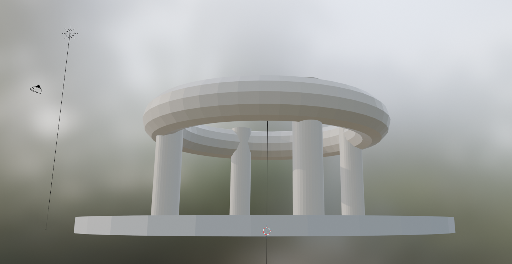

# Example: Creating a Boolean Pavilion

This example demonstrates how to use the Blender MCP server to create a modern architectural pavilion using boolean logic and unified structures. The conversation below shows a step-by-step interaction between a user and the AI agent to build the pavilion from scratch.

**Model Used:** GPT-5-Nano

## Conversation Log

**User:**
> 1. Create a new top-level collection named 'Boolean_Pavilion' and make it active

**Assistant:**
> Done. The top-level collection 'Boolean_Pavilion' has been created and is now the active collection for new objects.
> 
> Would you like me to add objects to it or move any existing objects into it? I can also create a sample object in this collection to verify.

---

**User:**
> 2. Create a torus named 'Dome' with major radius 8.6, minor radius 1.5 at location (0, 0, 8.5)

**Assistant:**
> Dome torus created successfully.
> 
> *   **Name:** Dome
> *   **Type:** Torus
> *   **Collection:** Boolean_Pavilion
> *   **Location:** (0, 0, 8.5)
> *   **Major radius:** 8.6
> *   **Minor radius:** 1.5
> *   **Rotation:** (0, 0, 0) (default)
> 
> Would you like me to:
> *   assign a material to it, 
> *   adjust its orientation or position, 
> *   add a floor/scene context (like a pedestal or > lighting), 
> *   or render a quick preview?

---

**User:**
> 3. Create a cylinder named 'Base_Slab' with radius 14 and height 1 at location (0, 0, 0.5)

**Assistant:**
> Base_Slab cylinder created successfully.
> 
> **Details:**
> *   **Name:** Base_Slab
> *   **Type:** Cylinder
> *   **Collection:** Boolean_Pavilion
> *   **Location:** (0, 0, 0.5)
> *   **Radius:** 14
> *   **Depth (height):** 1
> *   **Rotation:** (0, 0, 0) (default)
> 
> Would you like me to:
> *   assign a material, 
> *   adjust its orientation or position, 
> *   add context (floor/pedestal/lighting), 
> *   or render a quick preview?

---

**User:**
> 4. Create 4 cylindrical support pillars with radius 1 and height 10: - 'Pillar_North' at location (0, 8, 5) - 'Pillar_South' at location (0, -8, 5) - 'Pillar_East' at location (8, 0, 5) - 'Pillar_West' at location (-8, 0, 5)

**Assistant:**
> All four pillars have been created in the Boolean_Pavilion collection with the specified dimensions.
> 
> *   **Pillar_North:** cylinder at (0, 8, 5), radius 1, height 10 status created (geometry verified)
> *   **Pillar_South:** cylinder at (0, -8, 5), radius 1, height 10 status created (geometry verified)
> *   **Pillar_East:** cylinder at (8, 0, 5), radius 1, height 10 status created (geometry verified)
> *   **Pillar_West:** cylinder at (-8, 0, 5), radius 1, height 10 status created (geometry verified)
> 
> Would you like me to:
> *   assign a material to the pillars,
> *   add a base or pedestal,
> *   adjust spacing or alignment,
> *   or render a quick preview?

---

**User:**
> 5. Fuses the geometry of the torus and all 4 pillars (Pillar_*) into a single, unified object. Name it as Unified_Structure

**Assistant:**
> **Unified_Structure** has been created by fusing Dome and Pillar_North, Pillar_South, Pillar_East, and Pillar_West into a single object.
> 
> **Notes:**
> *   The resulting object is named **Unified_Structure**. It incorporates the torus and the four pillars into one mesh.
> *   The original Dome and Pillar_* objects are now merged into this single object.
> 
> Would you like me to:
> *   assign a material to Unified_Structure (e.g., metal or glass)? 
> *   adjust its origin/transform (e.g., center the origin at the combined geometry or move to a specific location)?
> *   place it into a collection or set up a quick pedestal or lighting?
> *   render a quick preview?

---

**User:**
> 6. Create a material named 'Dome_Concrete' with base color RGB (0.75, 0.72, 0.68) and roughness 0.4. Assign it to Unified_Structure

**Assistant:**
> Dome_Concrete material created and assigned to Unified_Structure.
> 
> **Summary:**
> *   **Material:** Dome_Concrete
> *   **Base color:** RGB (0.75, 0.72, 0.68) — hex #BFB8AD
> *   **Roughness:** 0.4
> *   **Assigned to:** Unified_Structure
> 
> Would you like me to adjust any material properties (metallic, transmission, etc.), or add a roughness/normal map for more realism?

---

**User:**
> 7. Create a material named 'Base_Stone' with base color RGB (0.65, 0.68, 0.72) and roughness 0.5. Assign it to Base_Slab

**Assistant:**
> Base_Stone material has been created and assigned to Base_Slab.
> 
> **Details:**
> *   **Material:** Base_Stone
> *   **Base color:** RGB (0.65, 0.68, 0.72) → hex #A5ADB8
> *   **Roughness:** 0.5
> *   **Assigned to:** Base_Slab
> *   **Assignment result**: 1 object updated
> 
> Would you like me to adjust metallic/transmission, or add a texture map (e.g., a subtle stone normal or roughness map)? I can also apply this material to additional objects using a pattern.

---

**User:**
> 8. Add a SUN light named 'Primary_Sun' with strength 3.0 and warm golden tone. Position it at location (18, -18, 22)

**Assistant:**
> Primary_Sun has been created.
> 
> **Details:**
> *   **Type:** SUN
> *   **Location:** (18, -18, 22)
> *   **Energy:** 3.0
> *   **Color:** #FFB347 (warm golden)
> *   **Status:** created
> 
> Would you like me to:
> *   adjust the sun’s angle or rotation for desired shadows,
> *   tweak its energy or color,
> *   render a quick preview with this lighting?

---

**User:**
> 9. Add an AREA light named 'Interior_Light' with strength 2.0 and cool blue tone at location (0, 0, 12)

**Assistant:**
> Interior_Light (AREA) created successfully.
> 
> **Details:**
> *   **Name:** Interior_Light
> *   **Type:** AREA
> *   **Location:** (0, 0, 12)
> *   **Energy:** 2.0
> *   **Color:** cool blue #66A2FF
> *   **Size:** 2
> *   **Status:** created
> 
> Would you like me to:
> *   adjust its orientation to direct light,
> *   tweak its energy or color,
> *   place it in a specific collection for organization,
> *   or render a quick preview with this lighting?

---

**User:**
> 10. Create a camera named 'Main_View' at location (22, -22, 16) looking at (0, 0, 9)

**Assistant:**
> Done. The camera **"Main_View"** has been created and placed at (22, -22, 16) with a perspective projection and is now looking at (0, 0, 9).
> 
> **Details:**
> *   **Name:** Main_View
> *   **Type:** PERSPECTIVE
> *   **Location:** (22, -22, 16)
> *   **Look-at target:** (0, 0, 9)
> *   **Status:** created
> 
> Would you like me to:
> *   set Main_View as the active camera,
> *   adjust the lens/focal length,
> *   render a quick preview from this view, or
> *   do any framing or animation setup?

