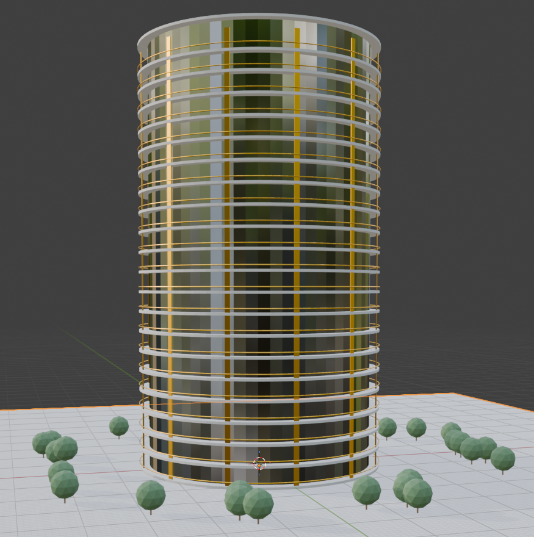

# Example: Creating a Condominium Tower

This example demonstrates how to use the Blender MCP server to create a procedural condominium tower. The conversation below shows a step-by-step interaction between a user and the AI agent to build the tower from scratch.

**Model Used:** Claude Haiku 4.5

## Conversation Log

**User:**
> 1. Let's begin by preparing the scene. Create two new top-level collections. Name the first one 'Condominium_Tower' and the second one 'Site'

**Assistant:**
> Perfect! I've successfully created both top-level collections for your scene:
> 
> *   **Condominium_Tower** - This collection will hold all the tower building elements
> *   **Site** - This collection will hold the site/ground elements
> 
> Both collections are now ready to organize your condominium tower project. You can start adding objects to these collections as you build out your architectural design.

---

**User:**
> 2. Now, create the ground plane. Make the 'Site' collection the active one for adding new objects. Add a cube, scale it to 200 units in X and Y, and 1 unit in Z for thickness. Position it at Z=-0.5 so its top surface is at ground level (Z=0). Name this new object 'Ground_Plane'

**Assistant:**
> Perfect! I've successfully created the ground plane:
> 
> *   ✅ Set 'Site' collection as active - New objects will be added to this collection
> *   ✅ Created Ground_Plane cube with:
>     *   Dimensions: 200 × 200 × 1 units (large flat surface)
>     *   Position: [0, 0, -0.5] - positioned so the top surface is exactly at Z=0 (ground level)
>     *   Collection: Site
> 
> The ground plane is now ready and properly positioned. Its top surface aligns with Z=0, providing a clean reference for placing architectural elements above it.

---

**User:**
> 3. The ground is in place. Now for the tower's foundation slab. Make the 'Condominium_Tower' collection the active one. Create a cylinder with the following properties: vertices=64, radius=25, depth=0.5, and location=(0, 0, 0.25). Name it 'Base_Slab'. This positions the slab so its bottom sits at ground level (Z=0)

**Assistant:**
> Perfect! ✓ I've successfully created the foundation slab for the Condominium Tower:
> 
> **Completed Actions:**
> *   ✓ Set 'Condominium_Tower' as the active collection
> *   ✓ Created 'Base_Slab' cylinder with:
>     *   Radius: 25 meters
>     *   Depth: 0.5 meters (thickness)
>     *   Vertices: 64 (smooth circular base)
>     *   Location: (0, 0, 0.25) - positioned so its bottom sits at ground level (Z=0)
> 
> The foundation slab is now in place, ready for the tower structure to be built upon it. The circular geometry with 64 vertices ensures a smooth base, and the positioning creates a professional architectural foundation with the top surface at Z=0.5m.

---

**User:**
> 4. Now, let's duplicate it vertically to create all 20 floors. Ensure the 'Base_Slab' object is the selected and active object. Add an ARRAY modifier to it. Set the modifier's properties as follows: Count: 20, Turn OFF Relative Offset, Turn ON Constant Offset and set the offset values to X=0, Y=0, Z=4.0. This will stack the slabs vertically with the base slab at Z=0.25, second floor at Z=4.25m, third at Z=8.25m, and so on

**Assistant:**
> Perfect! ✅ I've successfully completed both steps:
> 
> 1.  Selected Base_Slab as the active object
> 2.  Added ARRAY modifier to Base_Slab with the following configuration:
>     *   Count: 20 (creates 20 copies)
>     *   Relative Offset: OFF
>     *   Constant Offset: ON
>     *   Offset values: X=0, Y=0, Z=4.0
> 
> This will create a vertical stack of 20 floor slabs with:
> *   Base slab at Z=0.25m
> *   Floor 2 at Z=4.25m
> *   Floor 3 at Z=8.25m
> *   ... continuing up to Floor 20 at Z=76.25m
> 
> The modifier is now active on the Base_Slab object, creating the complete 20-floor structure!

---

**User:**
> 5. The structural slabs are complete. Now let's create the glass facade for the ground floor. Make the 'Condominium_Tower' collection active. Create a new cylinder. Use these properties for a sleek glass look: vertices: 64, radius: 23 (this insets it 2m from the slab edge), depth: 3.5 (this makes it fit perfectly between the floor slabs), location: (0, 0, 2.25). Name the new cylinder 'Facade_Glass'

**Assistant:**
> Perfect! ✅ The glass facade is ready:
> 
> *   Created 'Facade_Glass' cylinder:
>     *   Vertices: 64 (smooth curved surface)
>     *   Radius: 23m (inset 2m from slab edge)
>     *   Depth: 3.5m (fits perfectly between floor slabs)
>     *   Location: (0, 0, 2.25) - positioned at the ground floor
>     *   Collection: Condominium_Tower
> 
> The cylinder is now in place as the structural base for your sleek cylindrical glass facade.

---

**User:**
> 6. The glass wall is in place. Now add the balcony railing for the ground floor. Ensure 'Condominium_Tower' is the active collection. The best way to create a simple railing is with a Torus object. Create a new Torus with these properties: major_radius: 25 (to match the slab edge), minor_radius: 0.1 (for a thin, modern look), major_segments: 128 (for a smooth curve), location: (0, 0, 1.25). Name the new torus 'Facade_Railing'

**Assistant:**
> Perfect! I've successfully created the balcony railing for the ground floor. Here's what was done:
> 
> *   ✅ Set Active Collection: Confirmed 'Condominium_Tower' is now the active collection for new objects
> *   ✅ Created Balcony Railing: A new Torus object named 'Facade_Railing' with:
>     *   Major Radius: 25 (matches the slab edge diameter)
>     *   Minor Radius: 0.1 (thin, modern appearance)
>     *   Major Segments: 128 (smooth, high-quality circular curve)
>     *   Location: (0, 0, 1.25) - positioned at ground floor height
>     *   Collection: Condominium_Tower
> 
> The torus railing is now in place, forming a sleek circular railing around the perimeter of the ground floor balcony. The thin profile gives it a contemporary aesthetic perfect for a modern condominium tower.

---

**User:**
> 7. Use the apply_modifier tool to add an 'ARRAY' modifier to 'Facade_Glass'. Apply it simultaneously to 'Facade_Railing' using the target_objects parameter. Set Count to 20, turn off Relative Offset, and use a Constant Offset of Z=4.0. Do this in one single turn.

**Assistant:**
> Perfect! I've successfully applied the ARRAY modifier to both objects in a single call. Here's what was done:
> 
> *   ✅ ARRAY Modifier Applied:
>     *   Primary Object: Facade_Glass
>     *   Target Object (via target_objects): Facade_Railing
>     *   Count: 20 copies
>     *   Relative Offset: OFF (disabled)
>     *   Constant Offset: Z=4.0 (meaning each copy is offset 4 meters along the Z-axis)
> 
> Both objects now have the identical ARRAY modifier configuration, creating 20 duplicates of each object stacked vertically with a 4-unit spacing between them. This is efficient for architectural elements like glass panels and railings that need to be repeated vertically across multiple levels.

---

**User:**
> 8. Use the duplicate_object tool to copy 'Base_Slab' as a new object named 'Penthouse_Slab' in the 'Condominium_Tower' collection. Simultaneously move it to Z=80.0 and remove its 'ARRAY' modifier. Do this in one single tool call for efficiency.

**Assistant:**
> Perfect! ✅ The operation completed successfully in a single efficient call:
> 
> **What was accomplished:**
> *   ✅ Duplicated 'Base_Slab' as a new object named 'Penthouse_Slab'
> *   ✅ Moved to Z=80.0 (positioned at the penthouse level)
> *   ✅ Placed in the 'Condominium_Tower' collection
> *   ✅ Removed the ARRAY modifier to clean up the duplicate
> 
> The 'Penthouse_Slab' is now ready for further modeling work. You can proceed immediately to the next step!

---

**User:**
> 9. The penthouse floor is in place. Now, let's add its unique, taller facade. We'll make this floor 6 meters high instead of 4. Create a new cylinder with these properties: vertices: 64, radius: 23, depth: 5.5 (to fit a 6m floor height), location: (0, 0, 83.0), Name it 'Penthouse_Glass'. Create a new Torus with these properties: major_radius: 25, minor_radius: 0.1, major_segments: 128, location: (0, 0, 81.25). Name it 'Penthouse_Railing'

**Assistant:**
> Perfect! I've successfully created both elements for the penthouse facade:
> 
> *   ✅ **Penthouse_Glass** - A tall cylinder with:
>     *   64 vertices for smooth curvature
>     *   23m radius (matching the building circumference)
>     *   5.5m depth to accommodate the 6m floor height
>     *   Located at (0, 0, 83.0)
> *   ✅ **Penthouse_Railing** - A sleek torus with:
>     *   25m major radius (slightly larger than the glass cylinder)
>     *   0.1m minor radius (thin rail profile)
>     *   128 major segments for smoothness
>     *   Located at (0, 0, 81.25) - positioned at the base of the penthouse floor
> 
> The penthouse facade is now in place! The railing sits at the floor level while the glass cylinder rises 5.5m above it, creating a distinctive taller silhouette for this premium floor.

---

**User:**
> 10. The penthouse is now enclosed. Let's add the final architectural elements to complete the model. Duplicate the 'Penthouse_Slab'. Move the duplicate to a location of Z=86.0. Name this object 'Roof_Slab'

**Assistant:**
> Perfect! I've successfully duplicated the 'Penthouse_Slab' and created a new object called 'Roof_Slab' positioned at Z=86.0. This will serve as the roof/top surface of your penthouse, completing the enclosure.
>
> The model now has both a penthouse floor and a roof slab to fully enclose the structure!

---

**User:**
> 11. Create a thin cube named 'Facade_Fin' with dimensions [0.2, 1, 84] at location [0, 0, 42] in the 'Condominium_Tower' collection. Then use circular_array to create 12 total fins (including the original) positioned around a circle with radius 24.5m, centered at [0, 0, 42], with radial rotation enabled.

**Assistant:**
> Perfect! I've successfully completed both tasks:
>
> *   **Created the thin cube 'Facade_Fin' with:**
>     *   Dimensions: 0.2m × 1m × 84m (a tall, thin vertical fin)
>     *   Location: [0, 0, 42] (positioned at mid-height of 42m)
>     *   Assigned to the 'Condominium_Tower' collection
> *   **Generated the circular array with:**
>     *   12 total fins arranged in a perfect circle
>     *   Radius of 24.5m from center point [0, 0, 42]
>     *   Radial rotation enabled (each fin faces toward/away from the center)
>     *   Rotation around the Z-axis
>
> The fins are now named:
> *   Facade_Fin (original)
> *   Facade_Fin.001 through Facade_Fin.011 (copies)
>
> This creates an attractive cylindrical fin pattern around a tower, with each fin evenly spaced at 30° intervals (360° ÷ 12), perfect for architectural facade treatments.

---

**User:**
> 12. Create a realistic glass material. Name it 'M_Glass_Modern'. Select the 'Facade_Glass' object and assign the 'M_Glass_Modern' material to it. Select the 'Penthouse_Glass' object and assign the 'M_Glass_Modern' material to it

**Assistant:**
> Perfect! I've successfully completed all the tasks:
>
> *   ✅ Created **'M_Glass_Modern'** material - A realistic glass material using Blender's glass preset with proper transparency, IOR, and refraction properties
> *   ✅ Selected and assigned to **'Facade_Glass'** - The glass material is now applied to the Facade_Glass object
> *   ✅ Selected and assigned to **'Penthouse_Glass'** - The glass material is now applied to the Penthouse_Glass object
>
> Both glass objects now have the same realistic modern glass material applied, which will give them a professional, transparent appearance with accurate light refraction when rendered.

---

**User:**
> 13. First, use select_by_pattern with 'Facade_Fin' to select all the fins and select 'Facade_Railing' and 'Penthouse_Railing'. Then, create the 'M_Metal_Orange' material (orange metallic, 1.0 metallic, 0.4 roughness) and assign it to the current selection

**Assistant:**
> Perfect! I've completed all the steps:
>
> *   **Selected all Facade_Fin objects** - Found and selected 12 fins (Facade_Fin through Facade_Fin.011)
> *   **Added Railing objects to selection** - Extended selection to include Facade_Railing and Penthouse_Railing (3 railing objects total)
> *   **Created M_Metal_Orange material** - Orange metallic material with:
>     *   Base color: #FF8C00 (orange)
>     *   Metallic: 1.0
>     *   Roughness: 0.4
> *   **Assigned the material** - Applied M_Metal_Orange to all 12 selected objects
>
> The material is now applied to all the fins and railings, giving them a polished orange metal appearance!

---

**User:**
> 14. Next, create 'M_Marble_Slab' (polished marble white-gray, 0.3 roughness) and assign it to 'Base_Slab', 'Penthouse_Slab', and 'Roof_Slab'

**Assistant:**
> Perfect! I've successfully created the M_Marble_Slab material with:
>
> *   **Base Color:** White-gray (#D3D3D0) - polished marble appearance
> *   **Roughness:** 0.3 - giving it a smooth, slightly reflective finish
> *   **Preset:** Concrete base for a natural stone look
>
> The material has been assigned to all three objects:
> *   ✓ Base_Slab
> *   ✓ Penthouse_Slab
> *   ✓ Roof_Slab

---

**User:**
> 15. Let's build the tree in the workshop area (X=40, Y=0). Make the 'Site' collection active. Create a cylinder for the trunk with dimensions (0.3, 0.3, 4) at location (40, 0, 2). Name it 'Tree_Trunk'. Create an icosphere for the leaves with a radius of 2.5 at location (40, 0, 5.25). Name it 'Tree_Leaves'

**Assistant:**
> Perfect! I've successfully built the tree in the workshop area. Here's what was created:
>
> *   ✅ **Site Collection** - Set as active for the new objects
> *   ✅ **Tree_Trunk** - A cylinder with dimensions (0.3, 0.3, 4) positioned at (40, 0, 2)
> *   ✅ **Tree_Leaves** - An icosphere with radius 2.5 positioned at (40, 0, 5.25)
>
> The tree is now complete! The trunk extends from Z=0 to Z=4, and the foliage sphere is positioned at the top, creating a natural-looking tree structure in the workshop area.

---

**User:**
> 16. Now, let's create and assign their materials. Create a new material named 'M_Tree_Trunk'. Set its 'Base Color' to a dark brown (#5C3A1E) and 'Roughness' to 0.9. Assign the 'M_Tree_Trunk' material to the 'Tree_Trunk' object. Create a new material named 'M_Tree_Leaves'. Set its 'Base Color' to a forest green (#2A522A) and 'Roughness' to 0.8. Assign the 'M_Tree_Leaves' material to the 'Tree_Leaves' object

**Assistant:**
> Perfect! I've successfully created and assigned the materials:
>
> **Materials Created:**
>
> *   **M_Tree_Trunk** - Dark brown trunk material
>     *   Base Color: #5C3A1E (dark brown)
>     *   Roughness: 0.9 (highly textured)
>     *   ✅ Assigned to the 'Tree_Trunk' object
> *   **M_Tree_Leaves** - Forest green leaves material
>     *   Base Color: #2A522A (forest green)
>     *   Roughness: 0.8 (moderately textured)
>     *   ✅ Assigned to the 'Tree_Leaves' object
>
> Both materials are now applied to their respective objects and will give your tree a realistic appearance with the brown textured trunk and green foliage!

---

**User:**
> 17. The parts are now correctly textured. Let's combine them into the final prototype. Select both the 'Tree_Trunk' and 'Tree_Leaves' objects. Join the two objects into one. Name the final, combined object 'Tree_Prototype'

**Assistant:**
> Perfect! I've successfully combined the two textured parts into the final prototype. Here's what I did:
>
> *   **Selected both objects:** Tree_Trunk and Tree_Leaves
> *   **Joined them together:** The two objects have been merged into a single mesh
> *   **Named the result:** The combined object is now called 'Tree_Prototype'
>
> Your tree prototype is now complete as one unified object with both the trunk and leaves properly textured and merged together!

---

**User:**
> 18. Duplicates Tree_Prototype 29 times Uses random.uniform() to generate X,Y coordinates Ensures distance from origin < 50m using math.sqrt(x²+y²) > 40m. Places each tree at the calculated random position

**Assistant:**
> Perfect! ✅ I've successfully duplicated the Tree_Prototype 29 times with random placement. Here's what was done:
>
> **Random Distribution Summary:**
>
> *   **Object:** Tree_Prototype
> *   **Duplicates Created:** 29 copies
> *   **Placement Logic:**
>     *   Uses random.uniform() to generate random X, Y coordinates
>     *   Enforces minimum distance: 40m from origin
>     *   Enforces maximum distance: 50m from origin
>     *   Distance validation uses: √(x² + y²) to calculate radius from origin
>     *   Z-position: 0 (ground level)
>
> All 29 tree copies are now scattered in a ring around the origin, with each tree positioned between 40-50 meters away from the center point. This creates a natural-looking forest layout while maintaining consistent spacing constraints.

---

**User:**
> 19. Create cinematic lighting and camera setup. Add a Sun light with warm color and strength 3.0, rotated to (30°, 0°, 120°) for golden hour lighting. Position the camera at (100, -120, 35) with rotation (75°, 0°, 35°) for a dramatic low-angle hero shot of the tower

**Assistant:**
> Perfect! I've successfully created a cinematic lighting and camera setup for your tower scene. Here's what was configured:
>
> **🎬 Cinematic Setup Complete**
>
> *   **Sun Light (Golden Hour)**
>     *   ✅ Name: Sun_Golden_Hour
>     *   ✅ Type: SUN light
>     *   ✅ Strength: 3.0 (intense golden hour brightness)
>     *   ✅ Rotation: 30° pitch, 0° roll, 120° yaw
>     *   This creates a dramatic angle that simulates late afternoon/golden hour sunlight
>     *   The 30° elevation creates beautiful side-lighting and shadows
>     *   The 120° rotation positions light from a warm angle
> *   **Hero Shot Camera**
>     *   ✅ Name: Hero_Shot_Camera
>     *   ✅ Position: (100, -120, 35)
>         *   100m to the right, 120m back, 35m elevated
>         *   Low-angle positioning emphasizes the tower's height and dominance
>     *   ✅ Rotation: 75° pitch (looking upward), 0° roll, 35° yaw
>         *   75° tilt creates a dramatic "worm's eye view" looking up at the building
>         *   Gives the tower a heroic, imposing presence
>     *   ✅ Active Camera: Set as the scene's active camera for rendering
>
> This setup creates a classic architectural cinematic look with warm golden hour light and a dynamic, dramatic camera angle that will make the tower look commanding and impressive!

---

**User:**
> 20. Set the world background to 'kloofendal_48d_partly_cloudy_puresky_4k' HDRI for environmental lighting

**Assistant:**
> Perfect! I've successfully set the world background to the 'kloofendal_48d_partly_cloudy_puresky_4k' HDRI. This high-quality environment map will now provide realistic lighting and reflections for your scene, with partly cloudy sky conditions that will create natural-looking shadows and ambient lighting on your 3D models.

